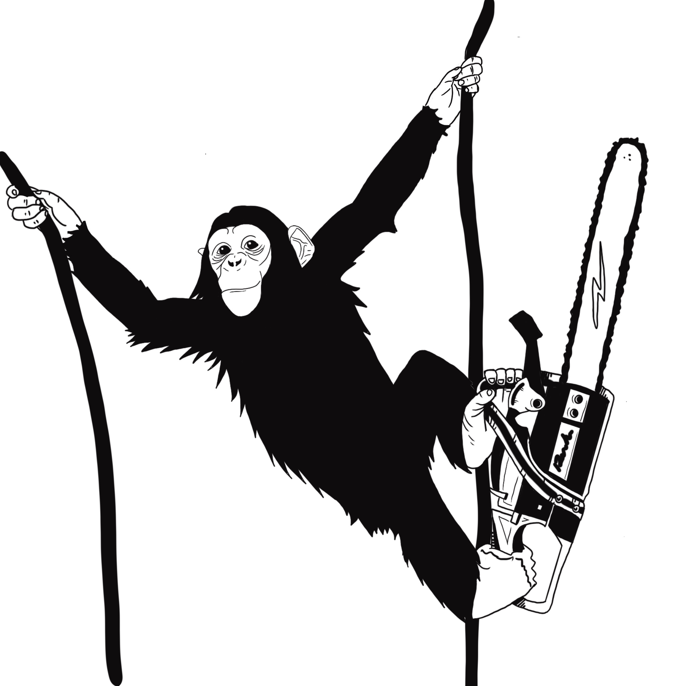

= Assignment 0
Prof. Darrell Long; CSE13S Spring 2021; Due: September 26th, 2021
:stem: latexmath
:source-highlighter: rouge
:toc: left
:toc-title: Sections

include::sections/1_intro.adoc[]

include::sections/2_vcs.adoc[]

include::sections/3_helloworld.adoc[]

include::sections/4_gitcommands.adoc[]

include::sections/5_honesty.adoc[]

include::sections/6_deliverables.adoc[]

include::sections/7_submission.adoc[]

[.text-center]
__Giving chainsaw to monkey, programming in *C* is like.__
